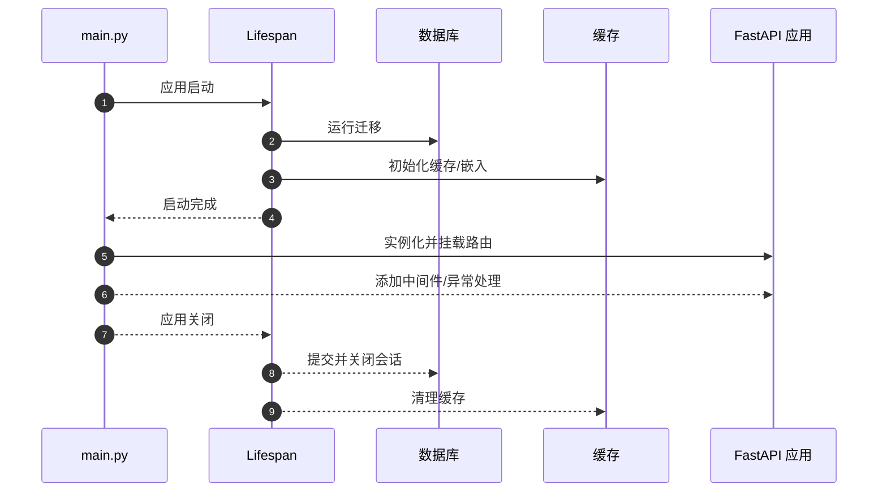
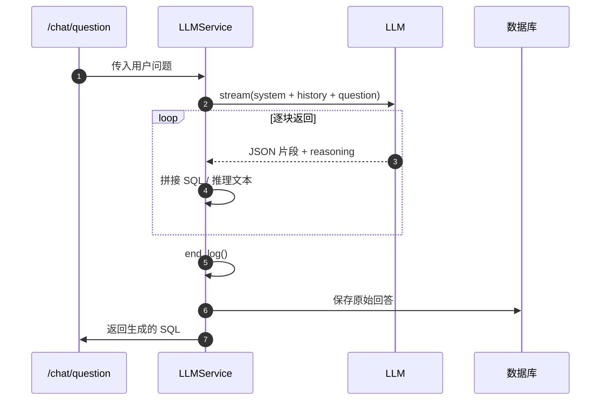
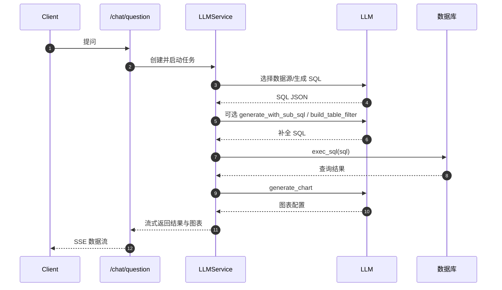

# SQLBot 代码分析报告

## 1. 启动流程与全局配置
- **应用入口** `backend/main.py` 中定义了 FastAPI 应用。启动时通过 `lifespan` 钩子执行数据库迁移、缓存初始化、动态 CORS 与嵌入数据填充，并在关闭时打印日志【F:backend/main.py†L32-L42】。
- 通过自定义的 `custom_generate_unique_id` 方法为路由生成可读的唯一 ID，随后实例化 FastAPI 应用并挂载路由、异常处理与中间件【F:backend/main.py†L45-L88】。

## 2. 配置系统
- 全局配置由 `Settings` 类负责，使用 `pydantic-settings` 从顶层 `.env` 加载环境变量，提供 API 前缀、数据库、CORS、日志等参数【F:backend/common/core/config.py†L24-L66】。
- 通过 `SQLALCHEMY_DATABASE_URI` 计算属性优先使用 `SQLBOT_DB_URL`，否则根据 Postgres 参数构造连接字符串【F:backend/common/core/config.py†L72-L84】。

## 3. 模型工厂与 LLM 接入
- `LLMConfig` 描述模型类型、名称、API 信息及附加参数，并实现哈希以便缓存【F:backend/apps/ai_model/model_factory.py†L19-L44】。
- `LLMFactory.create_llm` 使用 `_llm_types` 映射根据 `model_type` 生成具体的 LLM 实例，支持 OpenAI、vLLM、Azure 等实现【F:backend/apps/ai_model/model_factory.py†L105-L121】。
- `get_default_config` 从数据库加载默认模型配置、解密 API 信息并构造 `LLMConfig`【F:backend/apps/ai_model/model_factory.py†L141-L170】。

## 4. 数据模型与提示模板
- `ChatQuestion` 继承自 `AiModelQuestion`，封装了问题、数据源、语言等上下文，并提供 `sql_sys_question` / `sql_user_question` 等方法按模板生成系统与用户提示【F:backend/apps/chat/models/chat_model.py†L161-L189】。
- 模板内容位于 `backend/template.yaml`，在 `sql.system` 中定义了生成 SQL 的角色、规则与示例，要求模型返回含 `success`、`sql`、`tables` 等字段的 JSON【F:backend/template.yaml†L6-L109】。

## 5. LLMService 生成 SQL 全流程
### 5.1 初始化与上下文准备
- 构造函数加载聊天记录与数据源，解析数据库版本与 schema，并基于默认模型配置创建 LLM 实例【F:backend/apps/chat/task/llm.py†L73-L130】。
- 初始化消息时会附加系统提示，并将最近 6 条历史对话回放到 `sql_message`/`chart_message`，为模型提供上下文【F:backend/apps/chat/task/llm.py†L148-L186】。

#### 5.1.1 注入表结构、术语向量与提示词
- 通过 `get_table_schema` 读取当前数据源的所有表与字段信息，生成符合 **M‑Schema** 格式的字符串供模型参考；当前仅列出表和字段，未包含外键等表关系信息【F:backend/apps/datasource/crud/datasource.py†L344-L373】。
- `get_terminology_template` 先进行模糊匹配，再结合向量搜索（基于 pgvector 相似度）检索出与问题相关的专业术语，转换为 `<terminologies>` XML 片段【F:backend/apps/terminology/curd/terminology.py†L304-L347】。
- `ChatQuestion.sql_sys_question` 将数据库引擎、`<m-schema>` 字符串及 `<terminologies>` 片段填入系统提示模板，使模型在生成 SQL 时同时参考表结构与领域术语【F:backend/apps/chat/models/chat_model.py†L161-L177】。
- 选定数据源后，`LLMService` 会更新 `chat_question.terminologies` 并重新构建提示消息，以确保每次提问都携带最新的 schema 与术语信息【F:backend/apps/chat/task/llm.py†L503-L506】。
- 模板规则要求若需多表关联优先使用标记为主键/ID 的字段，但由于 `get_table_schema` 尚未补充外键信息，具体的表关系需要模型依据字段命名及主键描述自行推断。

### 5.2 流式生成 SQL
- `generate_sql` 将当前问题包装成用户消息，写入日志后通过 `llm.stream` 拉取模型输出；每个 chunk 同时包含 SQL 片段与推理片段，函数逐块拼接完整 SQL 并统计 token 使用量【F:backend/apps/chat/task/llm.py†L511-L542】。
- 生成完成后把汇总的 SQL 作为 `AIMessage` 追加到消息列表，并调用 `end_log` 记录推理文本及 token 统计，同时把原始回答保存到数据库【F:backend/apps/chat/task/llm.py†L543-L552】。

### 5.3 解析与补全
- `check_sql` 从模型返回的 JSON 中提取 `sql` 与表名，若解析失败或 SQL 为空则抛出错误【F:backend/apps/chat/task/llm.py†L726-L749】。
- `check_save_sql` 在解析成功后将 SQL 持久化到 `ChatQuestion` 记录，并统计耗时供后续分析【F:backend/apps/chat/task/llm.py†L751-L770】。
- `generate_with_sub_sql` 根据助手配置的子查询模板再次调用模型生成动态 SQL；`build_table_filter` 则用同样方式为行级权限追加过滤条件，两者都会记录推理日志与 token 数据【F:backend/apps/chat/task/llm.py†L554-L663】。
- `generate_filter` 与 `generate_assistant_filter` 分别用于普通数据源和助手数据源的行级权限处理，本质上都委托给 `build_table_filter`【F:backend/apps/chat/task/llm.py†L664-L679】。

### 5.4 `run_task` 执行链
- `run_task` 将上述步骤串联起来：若会话未绑定数据源则先由模型选择，随后校验数据库连通性并调用 `generate_sql` 得到初始 SQL【F:backend/apps/chat/task/llm.py†L928-L966】。
- 解析后根据是否启用动态数据源或权限过滤决定是否调用 `generate_assistant_dynamic_sql`、`generate_filter` 等进行补全，并把最终 SQL 保存和格式化返回【F:backend/apps/chat/task/llm.py†L967-L999】。
- 之后执行 SQL、缓存结果、继续调用模型生成图表配置并持久化，为前端提供结构化数据与图表【F:backend/apps/chat/task/llm.py†L1000-L1030】。

## 6. 路由与任务调度
- `backend/apps/chat/api/chat.py` 暴露了与前端交互的主要接口，如 `/chat/start` 创建会话、`/chat/question` 提问并流式返回结果。注意 `/assistant/start` 与 `/start` 使用同名函数，可能引起阅读混淆【F:backend/apps/chat/api/chat.py†L82-L102】【F:backend/apps/chat/api/chat.py†L130-L155】。
- `/chat/question` 中创建 `LLMService` 实例、记录提问并启动异步任务，随后通过 `StreamingResponse` 逐步返回生成结果【F:backend/apps/chat/api/chat.py†L130-L155】。

## 7. 逆向工程建议
1. **环境搭建**：阅读配置类并准备数据库、缓存、模型 API 密钥等运行时依赖。
2. **启动调试**：从 `main.py` 入手，调试 `lifespan` 生命周期以观察迁移与缓存初始化过程。
3. **模型调用链**：跟踪 `LLMService` 初始化与 `generate_sql` 调用，复现实例中的消息格式与日志记录。
4. **模板解析**：研究 `template.yaml` 中 SQL 生成规则及示例，了解输入输出格式约束。
5. **API 流程**：通过 `chat.py` 路由了解前后端通信协议及 SSE 流式返回机制。

以上分析覆盖了 SQLBot 生成 SQL 的关键路径，可作为逆向工程与功能扩展的参考。
