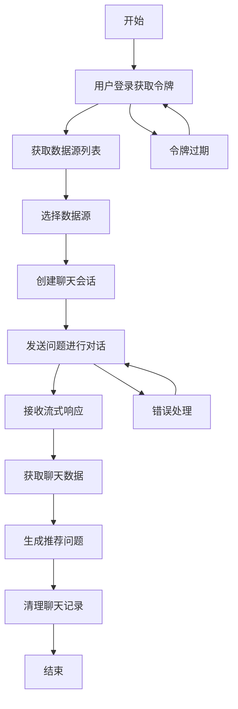

# SQLBot OpenAPI 接口文档

## 📖 概述

SQLBot OpenAPI 提供了完整的 AI 聊天机器人服务接口，支持用户认证、数据源管理、智能对话和推荐问题生成等功能。该接口遵循
RESTful 设计原则，支持流式响应，为开发者提供灵活的数据交互能力。

**基础信息：**

- **版本**: 1.0.0
- **作者**: huhuhuhr
- **日期**: 2025/08/31
- **基础路径**: `/openapi`
- **协议**: HTTP/HTTPS
- **数据格式**: JSON

---

## 🔄 API 使用流程

### 完整业务流程

SQLBot OpenAPI 的使用遵循特定的逻辑顺序，以下是完整的业务流程：

**1. 认证阶段** (必须首先执行)

- 调用 `/openapi/get_token` 获取访问令牌
- 可选择创建聊天会话
- 令牌具有有效期，过期需要重新获取

**2. 数据源准备阶段**

- 调用 `/openapi/getDataSourceList` 获取可用的数据源
- 确定要使用的数据源ID

**3. 对话交互阶段** (核心业务逻辑)

- 调用 `/openapi/chat` 进行AI对话
- 绑定数据源到聊天会话
- 发送用户问题，接收AI的流式回复

**4. 数据查询阶段**

- 调用 `/openapi/getData` 获取聊天记录的结构化数据
- 分析对话结果

**5. 智能推荐阶段**

- 调用 `/openapi/getRecommend` 基于历史生成推荐问题
- 提升用户体验

**6. 数据清理阶段**

- 调用 `/openapi/clean` 维护聊天记录
- 支持批量清理和全部清理

### 接口调用依赖关系

```
登录认证 → 获取数据源 → 聊天对话 → 获取数据 → 推荐问题 → 清理记录
    ↓           ↓          ↓         ↓         ↓         ↓
  get_token  getDataSourceList  chat    getData  getRecommend  clean
```

**重要说明**: 必须严格按照上述顺序调用接口，每个后续接口都依赖于前面接口的执行结果。

---

## 🔄 API 使用流程

### 完整业务流程

SQLBot OpenAPI 的使用遵循特定的逻辑顺序，以下是完整的业务流程：



### 1. 认证阶段

**必须首先执行**

```http
POST /openapi/getToken
```

- 获取访问令牌
- 可选择创建聊天会话
- 令牌具有有效期，过期需要重新获取

### 2. 数据源准备阶段

**获取可用的数据源**

```http
GET /openapi/getDataSourceList
```

- 查看用户可访问的数据源
- 确定要使用的数据源ID

### 3. 对话交互阶段

**核心业务逻辑**

```http
POST /openapi/chat
```

- 绑定数据源到聊天会话
- 发送用户问题
- 接收AI的流式回复

### 4. 数据查询阶段

**获取对话结果**

```http
POST /openapi/getData
```

- 根据聊天记录ID获取图表数据
- 分析对话结果

### 5. 智能推荐阶段

**基于历史生成建议**

```http
POST /openapi/getRecommend
```

- 基于聊天历史生成推荐问题
- 提升用户体验

### 6. 数据清理阶段

**维护聊天记录**

```http
POST /openapi/clean
```

- 清理过期的聊天记录
- 支持批量清理

---

## 🔐 认证机制

### 认证流程

1. **获取访问令牌**: 通过 `/openapi/getToken` 接口使用用户名和密码获取访问令牌
2. **令牌使用**: 在后续请求的请求头中包含访问令牌
3. **令牌过期**: 令牌具有有效期，过期后需要重新获取

### 请求头格式

```http
Authorization: Bearer {access_token}
X-Sqlbot-Token: {access_token}
Content-Type: application/json
```

---

## 📚 接口详细说明

### 1. 用户认证接口

#### 1.1 获取访问令牌

**接口地址**: `POST /openapi/getToken`

**接口描述**: 使用用户名和密码创建认证令牌，支持可选的聊天会话创建

**使用时机**: 必须首先调用，获取后续所有接口的访问权限

**请求参数**:

```json
{
  "username": "string",
  // 用户名（必填）
  "password": "string",
  // 密码（必填）
  "create_chat": boolean
  // 是否创建聊天会话（可选，默认false）
}
```

**响应示例**:

```json
{
  "access_token": "bearer eyJ0eXAiOiJKV1QiLCJhbGciOiJIUzI1NiJ9...",
  "token_type": "bearer",
  "expire": "2025-01-30 15:30:00",
  "chat_id": 123
}
```

**字段说明**:

- `access_token`: 完整的访问令牌字符串
- `token_type`: 令牌类型，固定为 "bearer"
- `expire`: 令牌过期时间，格式为 "YYYY-MM-DD HH:MM:SS"
- `chat_id`: 聊天会话ID，仅在 create_chat=true 时返回

**错误码**:

- `400`: 用户名密码错误、用户无工作空间关联、用户被禁用

**业务逻辑**:

- 验证用户身份和权限
- 检查用户工作空间关联状态
- 验证用户账户状态
- 可选择创建新的聊天会话
- 生成具有有效期的访问令牌

**后续步骤**: 获取令牌后，可以调用其他需要认证的接口

---

### 2. 数据源管理接口

#### 2.1 获取数据源列表

**接口地址**: `GET /openapi/getDataSourceList`

**接口描述**: 获取当前认证用户可访问的数据源列表

**使用时机**: 在认证成功后调用，了解可用的数据源

**请求头**: 需要认证令牌

**响应**: 数据源列表数组

**权限要求**: 需要有效的用户认证令牌

**使用时机**: 在认证成功后调用，了解可用的数据源

**后续步骤**: 从返回的列表中选择要使用的数据源ID

**业务逻辑**:

- 验证用户身份
- 根据用户权限过滤数据源
- 返回用户可访问的数据源信息

**后续步骤**: 从返回的列表中选择要使用的数据源ID

---

### 3. 智能对话接口

#### 3.1 数据库聊天

**接口地址**: `POST /openapi/chat`

**接口描述**: 基于指定数据源进行智能对话，支持流式响应

**使用时机**: 在确定数据源后调用，进行实际的AI对话

**请求参数**:

```json
{
  "question": "string",
  // 用户问题（必填）
  "chat_id": "integer",
  // 聊天会话ID（必填）
  "db_id": "integer"
  // 数据源ID（必填）
}
```

**请求头**: 需要认证令牌

**响应**: 流式响应 (`text/event-stream`)

**使用时机**: 在确定数据源后调用，进行实际的AI对话

**后续步骤**: 接收完流式响应后，可以调用 `/getData` 获取结构化数据

**错误码**:

- `500`: 数据源未找到、聊天处理失败

**业务逻辑**:

- 验证数据源存在性和用户权限
- 绑定数据源到聊天会话
- 创建LLM服务实例
- 初始化聊天记录
- 异步执行对话任务
- 返回流式响应结果

**流式响应说明**:

- 媒体类型: `text/event-stream`
- 实时返回AI生成的回复内容
- 支持长对话和复杂查询场景

**后续步骤**: 接收完流式响应后，可以调用 `/getData` 获取结构化数据

---

### 4. 数据查询接口

#### 4.1 获取聊天记录数据

**接口地址**: `POST /openapi/getData`

**接口描述**: 根据聊天记录ID获取相关的图表数据

**使用时机**: 在聊天对话完成后调用，获取结构化的结果数据

**请求参数**:

```json
{
  "chat_record_id": "integer"
  // 聊天记录ID（必填）
}
```

**请求头**: 需要认证令牌

**响应**: 图表数据对象

**使用时机**: 在聊天对话完成后调用，获取结构化的结果数据

**后续步骤**: 可以基于返回的数据进行可视化展示，或调用推荐接口

**业务逻辑**:

- 验证聊天记录存在性
- 异步执行数据库查询
- 返回图表相关数据

**后续步骤**: 可以基于返回的数据进行可视化展示，或调用推荐接口

---

### 5. 推荐问题接口

#### 5.1 获取推荐问题

**接口地址**: `POST /openapi/getRecommend`

**接口描述**: 基于历史聊天记录生成推荐问题，支持流式响应

**使用时机**: 在获取聊天数据后调用，为用户提供智能建议

**请求参数**:

```json
{
  "chat_record_id": "integer"
  // 聊天记录ID（必填）
}
```

**请求头**: 需要认证令牌

**响应**: 流式响应，包含推荐问题

**使用时机**: 在获取聊天数据后调用，为用户提供智能建议

**后续步骤**: 用户可以选择推荐问题进行新的对话

**错误码**:

- `400`: 聊天记录不存在
- `500`: 推荐问题生成失败

**业务逻辑**:

- 验证聊天记录存在性
- 创建LLM服务实例（推荐模式）
- 设置聊天记录上下文
- 异步生成推荐问题
- 返回流式响应结果

**后续步骤**: 用户可以选择推荐问题进行新的对话

---

### 6. 数据清理接口

#### 6.1 清理聊天记录

**接口地址**: `POST /openapi/clean`

**接口描述**: 清理当前用户的聊天记录，支持批量清理和全部清理

**使用时机**: 在需要维护聊天记录时调用，清理过期或不需要的记录

**请求参数**:

```json
{
  "chat_ids": [
    1,
    2,
    3
  ]
  // 可选：指定要清理的聊天记录ID列表
}
```

**请求头**: 需要认证令牌

**响应示例**:

```json
{
  "message": "聊天记录清理完成",
  "success_count": 5,
  "failed_count": 0,
  "total_count": 5,
  "failed_records": null
}
```

**字段说明**:

- `message`: 操作结果描述
- `success_count`: 成功清理的记录数量
- `failed_count`: 清理失败的记录数量
- `total_count`: 总记录数量
- `failed_records`: 失败记录详情列表（仅在失败时返回）

**使用时机**: 在需要维护聊天记录时调用，清理过期或不需要的记录

**后续步骤**: 清理完成后可以继续新的对话流程

**错误码**:

- `500`: 事务提交失败、清理异常

**业务逻辑**:

- 根据参数确定清理范围（指定记录或全部记录）
- 验证用户权限（只能清理自己的记录）
- 批量执行删除操作
- 记录成功和失败的操作结果
- 使用数据库事务确保数据一致性
- 返回详细的操作结果统计

---

## 🔧 使用示例

### 完整业务流程示例

以下是一个完整的API使用流程示例，展示了各个接口的调用顺序和依赖关系：

```python
import requests
import json
from typing import Optional, List, Dict, Any


class SQLBotClient:
    """
    SQLBot OpenAPI 客户端
    
    提供完整的接口调用封装，支持认证、聊天、数据查询等功能
    """

    def __init__(self, base_url: str = "http://localhost:8000"):
        """
        初始化客户端
        
        Args:
            base_url: API服务器基础URL
        """
        self.base_url = base_url
        self.token: Optional[str] = None
        self.headers: Dict[str, str] = {}
        self.current_chat_id: Optional[int] = None

    def login(self, username: str, password: str, create_chat: bool = True) -> Dict[str, Any]:
        """
        第一步：用户登录获取认证令牌
        
        Args:
            username: 用户名
            password: 密码
            create_chat: 是否创建聊天会话
            
        Returns:
            登录响应结果
            
        Raises:
            Exception: 登录失败时抛出异常
        """
        url = f"{self.base_url}/openapi/getToken"
        request_body = {
            "username": username,
            "password": password,
            "create_chat": create_chat
        }

        response = requests.post(url, json=request_body)
        if response.status_code == 200:
            result = response.json()
            self.token = result["access_token"]
            self.current_chat_id = result.get("chat_id")
            self.headers = {
                "Authorization": self.token,
                "Content-Type": "application/json"
            }
            return result
        else:
            raise Exception(f"登录失败: {response.text}")

    def get_datasource_list(self) -> List[Dict[str, Any]]:
        """
        第二步：获取数据源列表
        
        Returns:
            数据源列表
        """
        url = f"{self.base_url}/openapi/getDataSourceList"
        response = requests.get(url, headers=self.headers)
        response.raise_for_status()
        return response.json()

    def chat_with_db(self, db_id: int, question: str, chat_id: Optional[int] = None) -> requests.Response:
        """
        第三步：与数据库进行聊天对话
        
        Args:
            db_id: 数据源ID
            question: 用户问题
            chat_id: 聊天会话ID，如果为None则使用当前会话ID
            
        Returns:
            流式响应对象
        """
        if chat_id is None:
            chat_id = self.current_chat_id

        if chat_id is None:
            raise ValueError("聊天会话ID不能为空，请先登录或创建聊天会话")

        url = f"{self.base_url}/openapi/chat"
        request_body = {
            "db_id": db_id,
            "question": question,
            "chat_id": chat_id
        }

        response = requests.post(url, json=request_body, headers=self.headers)
        response.raise_for_status()
        return response

    def get_chat_data(self, chat_record_id: int) -> Dict[str, Any]:
        """
        第四步：获取聊天记录数据
        
        Args:
            chat_record_id: 聊天记录ID
            
        Returns:
            图表数据
        """
        url = f"{self.base_url}/openapi/getData"
        request_body = {
            "chat_record_id": chat_record_id
        }
        response = requests.post(url, json=request_body, headers=self.headers)
        response.raise_for_status()
        return response.json()

    def get_recommend_questions(self, chat_record_id: int) -> requests.Response:
        """
        第五步：获取推荐问题
        
        Args:
            chat_record_id: 聊天记录ID
            
        Returns:
            流式响应对象
        """
        url = f"{self.base_url}/openapi/getRecommend"
        request_body = {
            "chat_record_id": chat_record_id
        }
        response = requests.post(url, json=request_body, headers=self.headers)
        response.raise_for_status()
        return response

    def clean_chat_records(self, chat_ids: Optional[List[int]] = None) -> Dict[str, Any]:
        """
        第六步：清理聊天记录
        
        Args:
            chat_ids: 要清理的聊天记录ID列表，为空时清理所有记录
            
        Returns:
            清理操作结果
        """
        url = f"{self.base_url}/openapi/clean"
        request_body = {}
        if chat_ids:
            request_body["chat_ids"] = chat_ids

        response = requests.post(url, json=request_body, headers=self.headers)
        response.raise_for_status()
        return response.json()

    def is_authenticated(self) -> bool:
        """
        检查是否已认证
        
        Returns:
            是否已认证
        """
        return self.token is not None


# 完整业务流程示例
def complete_workflow_example():
    """
    完整的API使用流程示例
    
    展示了从登录到清理的完整业务流程
    """
    client = SQLBotClient()

    try:
        print("=== SQLBot OpenAPI 完整业务流程示例 ===\n")

        # 第一步：用户登录获取令牌
        print("1️⃣ 用户登录获取令牌...")
        login_result = client.login("your_username", "your_password", create_chat=True)
        print(f"✅ 登录成功！聊天会话ID: {login_result.get('chat_id')}")
        print(f"   令牌过期时间: {login_result.get('expire')}\n")

        # 第二步：获取数据源列表
        print("2️⃣ 获取数据源列表...")
        datasources = client.get_datasource_list()
        print(f"✅ 获取到 {len(datasources)} 个数据源")
        if datasources:
            first_datasource = datasources[0]
            print(f"   第一个数据源: {first_datasource.get('name')} (ID: {first_datasource.get('id')})\n")

        # 第三步：进行聊天对话
        print("3️⃣ 开始聊天对话...")
        db_id = first_datasource.get('id') if datasources else 1
        question = "查询用户表的数据量"

        chat_response = client.chat_with_db(
            db_id=db_id,
            question=question,
            chat_id=login_result.get('chat_id')
        )
        print(f"✅ 聊天请求已发送: '{question}'")
        print("   开始接收流式响应...\n")

        # 处理流式响应
        response_content = ""
        for line in chat_response.iter_lines():
            if line:
                line_text = line.decode('utf-8')
                response_content += line_text + "\n"
                print(f"   收到: {line_text}")

        print(f"\n✅ 聊天响应接收完成，总长度: {len(response_content)} 字符\n")

        # 第四步：获取聊天数据
        print("4️⃣ 获取聊天记录数据...")
        # 这里需要从聊天响应中获取chat_record_id，实际使用时需要解析响应
        chat_record_id = 123  # 示例ID
        try:
            chat_data = client.get_chat_data(chat_record_id)
            print(f"✅ 获取到聊天数据: {len(chat_data)} 条记录\n")
        except Exception as e:
            print(f"⚠️  获取聊天数据失败: {str(e)}\n")

        # 第五步：获取推荐问题
        print("5️⃣ 获取推荐问题...")
        try:
            recommend_response = client.get_recommend_questions(chat_record_id)
            print("✅ 推荐问题请求已发送，开始接收...")

            # 处理推荐问题流式响应
            recommend_content = ""
            for line in recommend_response.iter_lines():
                if line:
                    line_text = line.decode('utf-8')
                    recommend_content += line_text + "\n"
                    print(f"   推荐: {line_text}")

            print(f"✅ 推荐问题接收完成，总长度: {len(recommend_content)} 字符\n")

        except Exception as e:
            print(f"⚠️  获取推荐问题失败: {str(e)}\n")

        # 第六步：清理聊天记录
        print("6️⃣ 清理聊天记录...")
        try:
            clean_result = client.clean_chat_records()
            print(f"✅ 清理完成！")
            print(f"   成功: {clean_result.get('success_count')} 条")
            print(f"   失败: {clean_result.get('failed_count')} 条")
            print(f"   总计: {clean_result.get('total_count')} 条\n")

        except Exception as e:
            print(f"⚠️  清理聊天记录失败: {str(e)}\n")

        print("🎉 完整业务流程执行完成！")

    except Exception as e:
        print(f"❌ 业务流程执行失败: {str(e)}")
        print("请检查网络连接、认证信息和参数配置")


if __name__ == "__main__":
    complete_workflow_example()
```

### Java 客户端示例

```java
import com.alibaba.fastjson.JSON;
import org.springframework.stereotype.Service;
import org.springframework.beans.factory.annotation.Autowired;
import org.springframework.context.ApplicationContext;
import org.springframework.stereotype.Component;

import java.util.List;
import java.util.Map;
import java.util.Optional;

@Component
public class SQLBotClient {
    
    @Autowired
    private HttpService httpService;
    
    @Autowired
    private ApplicationContext applicationContext;
    
    private String baseUrl = "http://localhost:8000";
    private String token;
    private Map<String, String> headers;
    private Integer currentChatId;
    
    /**
     * 第一步：用户登录获取认证令牌
     * 
     * @param username 用户名
     * @param password 密码
     * @param createChat 是否创建聊天会话
     * @return 登录响应结果
     */
    public Map<String, Object> login(String username, String password, boolean createChat) {
        String url = baseUrl + "/openapi/getToken";
        
        Map<String, Object> requestBody = Map.of(
            "username", username,
            "password", password,
            "create_chat", createChat
        );
        
        Response response = httpService.doPost(url, JSON.toJSONString(requestBody));
        
        if (response.isSuccess()) {
            Map<String, Object> result = JSON.parseObject(response.getBody(), Map.class);
            this.token = (String) result.get("access_token");
            this.currentChatId = (Integer) result.get("chat_id");
            this.headers = Map.of(
                "Authorization", this.token,
                "Content-Type", "application/json"
            );
            return result;
        } else {
            throw new RuntimeException("登录失败: " + response.getBody());
        }
    }
    
    /**
     * 第二步：获取数据源列表
     * 
     * @return 数据源列表响应
     */
    public Response getDataSourceList() {
        String url = baseUrl + "/openapi/getDataSourceList";
        return httpService.doGet(url, headers);
    }
    
    /**
     * 第三步：与数据库进行聊天对话
     * 
     * @param dbId 数据源ID
     * @param question 用户问题
     * @param chatId 聊天会话ID（可选，为空时使用当前会话ID）
     * @return 聊天响应
     */
    public Response chatWithDb(String dbId, String question, Integer chatId) {
        String url = baseUrl + "/openapi/chat";
        
        // 如果没有指定聊天ID，使用当前会话ID
        if (chatId == null) {
            chatId = this.currentChatId;
        }
        
        if (chatId == null) {
            throw new RuntimeException("聊天会话ID不能为空，请先登录或创建聊天会话");
        }
        
        Map<String, Object> requestBody = Map.of(
            "db_id", dbId,
            "question", question,
            "chat_id", chatId
        );
        
        return httpService.doPost(url, JSON.toJSONString(requestBody), headers);
    }
    
    /**
     * 第四步：获取聊天记录数据
     * 
     * @param chatRecordId 聊天记录ID
     * @return 图表数据响应
     */
    public Response getChatData(Integer chatRecordId) {
        String url = baseUrl + "/openapi/getData";
        
        Map<String, Object> requestBody = Map.of("chat_record_id", chatRecordId);
        return httpService.doPost(url, JSON.toJSONString(requestBody), headers);
    }
    
    /**
     * 第五步：获取推荐问题
     * 
     * @param chatRecordId 聊天记录ID
     * @return 推荐问题响应
     */
    public Response getRecommendQuestions(Integer chatRecordId) {
        String url = baseUrl + "/openapi/getRecommend";
        
        Map<String, Object> requestBody = Map.of("chat_record_id", chatRecordId);
        return httpService.doPost(url, JSON.toJSONString(requestBody), headers);
    }
    
    /**
     * 第六步：清理指定聊天记录
     * 
     * @param chatIds 要清理的聊天记录ID列表
     * @return 清理操作响应
     */
    public Response cleanChatRecords(List<Integer> chatIds) {
        String url = baseUrl + "/openapi/clean";
        
        Map<String, Object> requestBody = Map.of("chat_ids", chatIds);
        return httpService.doPost(url, JSON.toJSONString(requestBody), headers);
    }
    
    /**
     * 第六步：清理所有聊天记录
     * 
     * @return 清理操作响应
     */
    public Response cleanAllChatRecords() {
        String url = baseUrl + "/openapi/clean";
        return httpService.doPost(url, "{}", headers);
    }
    
    /**
     * 检查是否已认证
     * 
     * @return 是否已认证
     */
    public boolean isAuthenticated() {
        return token != null && !token.isEmpty();
    }
    
    /**
     * 获取当前聊天会话ID
     * 
     * @return 当前聊天会话ID
     */
    public Integer getCurrentChatId() {
        return currentChatId;
    }
}

// 完整业务流程示例
@Service
public class SQLBotService {
    
    @Autowired
    private SQLBotClient sqlBotClient;
    
    /**
     * 完整的API使用流程示例
     */
    public void completeWorkflowExample() {
        try {
            System.out.println("=== SQLBot OpenAPI 完整业务流程示例 ===\n");
            
            // 第一步：用户登录
            System.out.println("1️⃣ 用户登录获取令牌...");
            Map<String, Object> loginResult = sqlBotClient.login("your_username", "your_password", true);
            System.out.println("✅ 登录成功，聊天ID: " + loginResult.get("chat_id"));
            System.out.println("   令牌过期时间: " + loginResult.get("expire") + "\n");
            
            // 第二步：获取数据源列表
            System.out.println("2️⃣ 获取数据源列表...");
            Response datasourcesResponse = sqlBotClient.getDataSourceList();
            if (datasourcesResponse.isSuccess()) {
                List<Map<String, Object>> datasources = JSON.parseArray(
                    datasourcesResponse.getBody(), Map.class);
                System.out.println("✅ 获取到 " + datasources.size() + " 个数据源\n");
                
                // 第三步：进行聊天对话
                if (!datasources.isEmpty()) {
                    System.out.println("3️⃣ 开始聊天对话...");
                    Map<String, Object> firstDatasource = datasources.get(0);
                    String dbId = (String) firstDatasource.get("id");
                    String question = "查询用户表的数据量";
                    
                    Response chatResponse = sqlBotClient.chatWithDb(
                        dbId,
                        question,
                        (Integer) loginResult.get("chat_id")
                    );
                    System.out.println("✅ 聊天请求已发送: '" + question + "'\n");
                    
                    // 第四步：获取聊天数据
                    System.out.println("4️⃣ 获取聊天记录数据...");
                    Integer chatRecordId = 123; // 示例ID，实际使用时需要从聊天响应中获取
                    Response chatDataResponse = sqlBotClient.getChatData(chatRecordId);
                    if (chatDataResponse.isSuccess()) {
                        System.out.println("✅ 获取到聊天数据\n");
                    } else {
                        System.out.println("⚠️  获取聊天数据失败\n");
                    }
                    
                    // 第五步：获取推荐问题
                    System.out.println("5️⃣ 获取推荐问题...");
                    Response recommendResponse = sqlBotClient.getRecommendQuestions(chatRecordId);
                    System.out.println("✅ 推荐问题请求已发送\n");
                    
                    // 第六步：清理聊天记录
                    System.out.println("6️⃣ 清理聊天记录...");
                    Response cleanResponse = sqlBotClient.cleanAllChatRecords();
                    if (cleanResponse.isSuccess()) {
                        Map<String, Object> cleanResult = JSON.parseObject(
                            cleanResponse.getBody(), Map.class);
                        System.out.println("✅ 清理完成！");
                        System.out.println("   成功: " + cleanResult.get("success_count") + " 条");
                        System.out.println("   失败: " + cleanResult.get("failed_count") + " 条");
                        System.out.println("   总计: " + cleanResult.get("total_count") + " 条\n");
                    } else {
                        System.out.println("⚠️  清理聊天记录失败\n");
                    }
                }
            }
            
            System.out.println("🎉 完整业务流程执行完成！");
            
        } catch (Exception e) {
            System.err.println("❌ 业务流程执行失败: " + e.getMessage());
        }
    }
}
```

---

## ⚠️ 重要注意事项

### 1. 认证要求

- 除登录接口外，所有接口都需要有效的认证令牌
- 令牌具有有效期，过期后需要重新获取
- 建议在令牌过期前主动刷新

### 2. 流式响应处理

- 聊天和推荐问题接口使用流式响应
- 媒体类型为 `text/event-stream`
- 客户端需要正确处理流式数据
- 支持长对话和复杂查询场景

### 3. 错误处理

- 所有接口都可能返回 HTTP 错误码
- 建议实现统一的异常处理机制
- 注意区分业务错误和系统错误

### 4. 数据安全

- 用户只能访问自己有权限的数据源和聊天记录
- 所有操作都会进行权限验证
- 敏感信息通过HTTPS传输

### 5. 事务处理

- 清理接口使用数据库事务确保数据一致性
- 批量操作支持部分成功部分失败的情况
- 失败操作会提供详细的错误信息

### 6. 接口变更

- 接口遵循版本化管理
- 重要变更会在文档中明确标注
- 建议定期检查接口文档更新

### 7. 调用顺序要求

- **必须严格按照文档中的顺序调用接口**
- 认证接口必须在其他接口之前调用
- 聊天接口必须在获取数据源列表之后调用
- 数据查询和推荐接口必须在聊天完成后调用
- 清理接口可以在任何时候调用，但建议在操作完成后调用

---

## 🔍 错误码详细说明

| 状态码 | 错误类型  | 说明            | 处理建议               |
|-----|-------|---------------|--------------------|
| 200 | 成功    | 请求处理成功        | 正常处理响应数据           |
| 400 | 客户端错误 | 请求参数错误、用户状态异常 | 检查请求参数格式和内容，验证用户状态 |
| 401 | 未授权   | 认证令牌无效或过期     | 重新获取认证令牌           |
| 403 | 禁止访问  | 用户权限不足        | 检查用户权限配置           |
| 404 | 资源不存在 | 请求的资源ID不正确    | 验证资源ID的有效性         |
| 500 | 服务器错误 | 系统内部错误、处理异常   | 联系技术支持或查看系统日志      |

### 常见错误处理

#### 认证失败 (400)

```json
{
  "detail": "用户名或密码错误"
}
```

**处理方式**: 检查用户名和密码，确认账户状态

#### 数据源未找到 (500)

```json
{
  "detail": "数据源未找到"
}
```

**处理方式**: 验证数据源ID，检查用户权限

#### 聊天记录不存在 (400)

```json
{
  "detail": "聊天记录ID 123 不存在"
}
```

**处理方式**: 验证聊天记录ID的有效性

---

## 📊 性能优化建议

### 1. 连接管理

- 使用连接池管理HTTP连接
- 复用认证令牌，避免频繁登录
- 合理设置超时时间

### 2. 流式响应处理

- 使用异步方式处理流式数据
- 避免阻塞主线程
- 实现断线重连机制

### 3. 批量操作

- 清理接口支持批量操作
- 合理控制批量大小
- 监控操作性能指标

### 4. 缓存策略

- 缓存数据源列表等静态信息
- 合理设置缓存过期时间
- 实现缓存失效机制

---

## 🔄 接口变更记录

### v1.0.0 (2025-01-30)

- 🆕 新增用户认证接口 `/getToken`
- 🆕 新增数据源管理接口 `/getDataSourceList`
- 🆕 新增智能对话接口 `/chat`
- 🆕 新增数据查询接口 `/getData`
- 🆕 新增推荐问题接口 `/getRecommend`
- 🆕 新增数据清理接口 `/clean`
- ✨ 支持流式响应
- ✨ 完整的错误处理机制
- ✨ 事务安全保证
- 📝 完善的中文文档和注释
- 🔄 明确的接口调用顺序和业务流程说明

---

## 📞 技术支持

### 联系方式

- **开发团队**: huhuhuhr
- **项目地址**: SQLBot OpenAPI
- **文档版本**: 1.0.0
- **最后更新**: 2025年1月30日

### 问题反馈

如遇到问题，请按以下步骤处理：

1. **查看错误日志**: 检查系统日志获取详细错误信息
2. **验证请求参数**: 确认请求格式和参数正确性
3. **检查认证状态**: 验证令牌有效性和权限配置
4. **确认调用顺序**: 检查是否按照正确的顺序调用接口
5. **联系技术支持**: 提供详细的错误信息和复现步骤

### 开发建议

- 建议使用HTTPS协议确保数据传输安全
- 实现完善的错误处理和重试机制
- 定期检查接口文档更新
- 遵循RESTful API设计最佳实践
- **严格按照文档中的接口调用顺序进行开发**

---

*本文档基于 SQLBot OpenAPI v1.0.0 版本编写，如有疑问请联系开发团队。*
